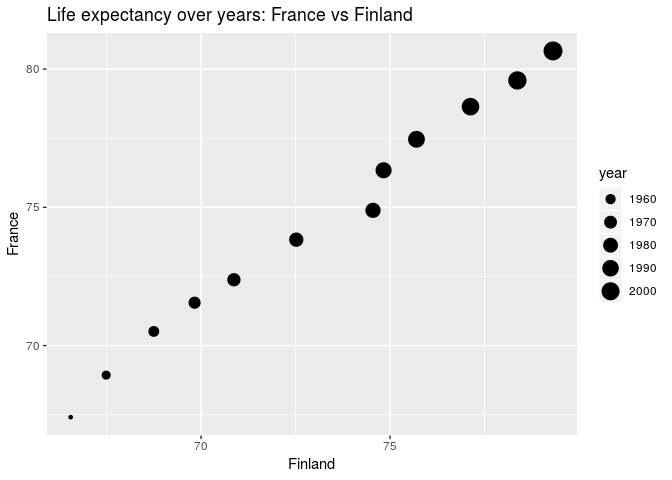
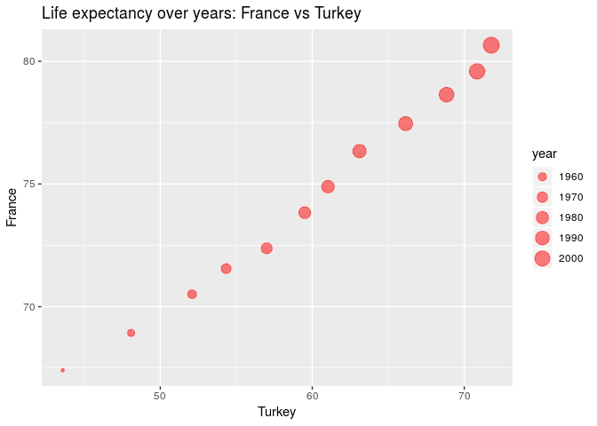

Homework\_04
================
Sarafa Iyaniwura
October 5, 2018

-   [Homework 04: Tidy data and join](#homework-04-tidy-data-and-join)
    -   [Loading libraries](#loading-libraries)
    -   [Data Reshaping Prompt (and relationship to aggregation)](#data-reshaping-prompt-and-relationship-to-aggregation)
        -   [Activity \#2](#activity-2)
        -   [Activity \#4](#activity-4)
    -   [Join Prompts (join, merge, look up)](#join-prompts-join-merge-look-up)
        -   [Activity \#1](#activity-1)

Homework 04: Tidy data and join
===============================

-   In this assignment, we shall be using tidy data to aggregate and reshape data.

Let us begin by loading the necessary packages for these exercises.

Loading libraries
-----------------

``` r
library(tidyr) # loads tidyr library
library(dplyr)  # loads dplyr library
```

    ## 
    ## Attaching package: 'dplyr'

    ## The following objects are masked from 'package:stats':
    ## 
    ##     filter, lag

    ## The following objects are masked from 'package:base':
    ## 
    ##     intersect, setdiff, setequal, union

``` r
library(gapminder)  # loads gapminder data
library(ggplot2) # loads ggplot library
library(reshape2) # loads reshape library
```

    ## 
    ## Attaching package: 'reshape2'

    ## The following object is masked from 'package:tidyr':
    ## 
    ##     smiths

Data Reshaping Prompt (and relationship to aggregation)
-------------------------------------------------------

### Activity \#2

-   Make a tibble with one row per year and column for life expectancy for two or more countries.

    -   Use `knitr::kable()` to make this table look pretty in your rendered homework
    -   Take advantage of this new data shape to scatterplot life expectancy for one country against that of another

Let us start be extracting the life expectancy data for European countries only.

``` r
EU_LifExp <- gapminder  %>%  # loads gapminder data
  filter(continent == 'Europe') %>%  # collects only European countries
  select(year,country,lifeExp) # selects the columns listed

# displaying table
head(EU_LifExp,15) %>% # displays only the first 15 lines of EU_LifExp
  knitr::kable()
```

|  year| country |  lifeExp|
|-----:|:--------|--------:|
|  1952| Albania |   55.230|
|  1957| Albania |   59.280|
|  1962| Albania |   64.820|
|  1967| Albania |   66.220|
|  1972| Albania |   67.690|
|  1977| Albania |   68.930|
|  1982| Albania |   70.420|
|  1987| Albania |   72.000|
|  1992| Albania |   71.581|
|  1997| Albania |   72.950|
|  2002| Albania |   75.651|
|  2007| Albania |   76.423|
|  1952| Austria |   66.800|
|  1957| Austria |   67.480|
|  1962| Austria |   69.540|

Now, let us use the `spread()` function of make a data frame that has the life expectancy of each of the European countries in its column, and the years in the rows.

``` r
EU_spread <- EU_LifExp %>%  # loads EU_LifeExp and pipes it into the next line
            spread( key = "country",value = "lifeExp")  # make a new data frame whose rows are years and columns are life expectancy for each European country

knitr::kable(EU_spread)
```

|  year|  Albania|  Austria|  Belgium|  Bosnia and Herzegovina|  Bulgaria|  Croatia|  Czech Republic|  Denmark|  Finland|  France|  Germany|  Greece|  Hungary|  Iceland|  Ireland|   Italy|  Montenegro|  Netherlands|  Norway|  Poland|  Portugal|  Romania|  Serbia|  Slovak Republic|  Slovenia|   Spain|  Sweden|  Switzerland|  Turkey|  United Kingdom|
|-----:|--------:|--------:|--------:|-----------------------:|---------:|--------:|---------------:|--------:|--------:|-------:|--------:|-------:|--------:|--------:|--------:|-------:|-----------:|------------:|-------:|-------:|---------:|--------:|-------:|----------------:|---------:|-------:|-------:|------------:|-------:|---------------:|
|  1952|   55.230|   66.800|   68.000|                  53.820|    59.600|   61.210|          66.870|   70.780|   66.550|  67.410|   67.500|  65.860|   64.030|   72.490|   66.910|  65.940|      59.164|       72.130|  72.670|  61.310|    59.820|   61.050|  57.996|           64.360|    65.570|  64.940|  71.860|       69.620|  43.585|          69.180|
|  1957|   59.280|   67.480|   69.240|                  58.450|    66.610|   64.770|          69.030|   71.810|   67.490|  68.930|   69.100|  67.860|   66.410|   73.470|   68.900|  67.810|      61.448|       72.990|  73.440|  65.770|    61.510|   64.100|  61.685|           67.450|    67.850|  66.660|  72.490|       70.560|  48.079|          70.420|
|  1962|   64.820|   69.540|   70.250|                  61.930|    69.510|   67.130|          69.900|   72.350|   68.750|  70.510|   70.300|  69.510|   67.960|   73.680|   70.290|  69.240|      63.728|       73.230|  73.470|  67.640|    64.390|   66.800|  64.531|           70.330|    69.150|  69.690|  73.370|       71.320|  52.098|          70.760|
|  1967|   66.220|   70.140|   70.940|                  64.790|    70.420|   68.500|          70.380|   72.960|   69.830|  71.550|   70.800|  71.000|   69.500|   73.730|   71.080|  71.060|      67.178|       73.820|  74.080|  69.610|    66.600|   66.800|  66.914|           70.980|    69.180|  71.440|  74.160|       72.770|  54.336|          71.360|
|  1972|   67.690|   70.630|   71.440|                  67.450|    70.900|   69.610|          70.290|   73.470|   70.870|  72.380|   71.000|  72.340|   69.760|   74.460|   71.280|  72.190|      70.636|       73.750|  74.340|  70.850|    69.260|   69.210|  68.700|           70.350|    69.820|  73.060|  74.720|       73.780|  57.005|          72.010|
|  1977|   68.930|   72.170|   72.800|                  69.860|    70.810|   70.640|          70.710|   74.690|   72.520|  73.830|   72.500|  73.680|   69.950|   76.110|   72.030|  73.480|      73.066|       75.240|  75.370|  70.670|    70.410|   69.460|  70.300|           70.450|    70.970|  74.390|  75.440|       75.390|  59.507|          72.760|
|  1982|   70.420|   73.180|   73.930|                  70.690|    71.080|   70.460|          70.960|   74.630|   74.550|  74.890|   73.800|  75.240|   69.390|   76.990|   73.100|  74.980|      74.101|       76.050|  75.970|  71.320|    72.770|   69.660|  70.162|           70.800|    71.063|  76.300|  76.420|       76.210|  61.036|          74.040|
|  1987|   72.000|   74.940|   75.350|                  71.140|    71.340|   71.520|          71.580|   74.800|   74.830|  76.340|   74.847|  76.670|   69.580|   77.230|   74.360|  76.420|      74.865|       76.830|  75.890|  70.980|    74.060|   69.530|  71.218|           71.080|    72.250|  76.900|  77.190|       77.410|  63.108|          75.007|
|  1992|   71.581|   76.040|   76.460|                  72.178|    71.190|   72.527|          72.400|   75.330|   75.700|  77.460|   76.070|  77.030|   69.170|   78.770|   75.467|  77.440|      75.435|       77.420|  77.320|  70.990|    74.860|   69.360|  71.659|           71.380|    73.640|  77.570|  78.160|       78.030|  66.146|          76.420|
|  1997|   72.950|   77.510|   77.530|                  73.244|    70.320|   73.680|          74.010|   76.110|   77.130|  78.640|   77.340|  77.869|   71.040|   78.950|   76.122|  78.820|      75.445|       78.030|  78.320|  72.750|    75.970|   69.720|  72.232|           72.710|    75.130|  78.770|  79.390|       79.370|  68.835|          77.218|
|  2002|   75.651|   78.980|   78.320|                  74.090|    72.140|   74.876|          75.510|   77.180|   78.370|  79.590|   78.670|  78.256|   72.590|   80.500|   77.783|  80.240|      73.981|       78.530|  79.050|  74.670|    77.290|   71.322|  73.213|           73.800|    76.660|  79.780|  80.040|       80.620|  70.845|          78.471|
|  2007|   76.423|   79.829|   79.441|                  74.852|    73.005|   75.748|          76.486|   78.332|   79.313|  80.657|   79.406|  79.483|   73.338|   81.757|   78.885|  80.546|      74.543|       79.762|  80.196|  75.563|    78.098|   72.476|  74.002|           74.663|    77.926|  80.941|  80.884|       81.701|  71.777|          79.425|

Let us display the `EU_spread` data frame for only few selected countries.

``` r
# displaying table
EU_spread %>% # loads EU_spread
  select(year,France,Finland,Turkey) %>%  # selects columns for the listed countries
  knitr::kable()
```

|  year|  France|  Finland|  Turkey|
|-----:|-------:|--------:|-------:|
|  1952|  67.410|   66.550|  43.585|
|  1957|  68.930|   67.490|  48.079|
|  1962|  70.510|   68.750|  52.098|
|  1967|  71.550|   69.830|  54.336|
|  1972|  72.380|   70.870|  57.005|
|  1977|  73.830|   72.520|  59.507|
|  1982|  74.890|   74.550|  61.036|
|  1987|  76.340|   74.830|  63.108|
|  1992|  77.460|   75.700|  66.146|
|  1997|  78.640|   77.130|  68.835|
|  2002|  79.590|   78.370|  70.845|
|  2007|  80.657|   79.313|  71.777|

We can plot the life expectancy for one country against the other using `geom_point()` in ggplot.

``` r
# Plotting data
EU_spread %>% # loads EU_spread
  ggplot(aes(Finland,France, size=year) ) + # plots data for 
         geom_point(aes(size=year)) + ggtitle("Life expectancy over years: France vs Finland")  # specifies the type of plot and the title
```



How about for Turkey and France ?

``` r
# Plotting data
EU_spread %>% # loads EU_spread
  ggplot(aes(Turkey,France, size=year) ) + # plots data for 
         geom_point(aes(size=year),color = "red", alpha=0.5) + ggtitle("Life expectancy over years: Turkey vs Finland") # specifies the type of plot and the title
```



### Activity \#4

-   In Windows fucntions, we formed a tobble with 24 rows: 2 per year, giving the country with both the lowest and higest life expectancy (in Asia). Take that table (or a small one for all continents) and reshape it so you have one row per year or per year\*continent combination

``` r
WinData <- gapminder %>%
    filter(continent=="Asia") %>%
    select(year, country, lifeExp) %>%
    group_by(year) %>%
    filter(min_rank(desc(lifeExp)) < 2 | min_rank(lifeExp) < 2) %>% 
    arrange(year) 

# displaying data
WinData %>%
   knitr::kable()
```

|  year| country     |  lifeExp|
|-----:|:------------|--------:|
|  1952| Afghanistan |   28.801|
|  1952| Israel      |   65.390|
|  1957| Afghanistan |   30.332|
|  1957| Israel      |   67.840|
|  1962| Afghanistan |   31.997|
|  1962| Israel      |   69.390|
|  1967| Afghanistan |   34.020|
|  1967| Japan       |   71.430|
|  1972| Afghanistan |   36.088|
|  1972| Japan       |   73.420|
|  1977| Cambodia    |   31.220|
|  1977| Japan       |   75.380|
|  1982| Afghanistan |   39.854|
|  1982| Japan       |   77.110|
|  1987| Afghanistan |   40.822|
|  1987| Japan       |   78.670|
|  1992| Afghanistan |   41.674|
|  1992| Japan       |   79.360|
|  1997| Afghanistan |   41.763|
|  1997| Japan       |   80.690|
|  2002| Afghanistan |   42.129|
|  2002| Japan       |   82.000|
|  2007| Afghanistan |   43.828|
|  2007| Japan       |   82.603|

``` r
WinData %>%
  spread( key = "country",value = "lifeExp") %>%  
  knitr::kable()  
```

|  year|  Afghanistan|  Cambodia|  Israel|   Japan|
|-----:|------------:|---------:|-------:|-------:|
|  1952|       28.801|        NA|   65.39|      NA|
|  1957|       30.332|        NA|   67.84|      NA|
|  1962|       31.997|        NA|   69.39|      NA|
|  1967|       34.020|        NA|      NA|  71.430|
|  1972|       36.088|        NA|      NA|  73.420|
|  1977|           NA|     31.22|      NA|  75.380|
|  1982|       39.854|        NA|      NA|  77.110|
|  1987|       40.822|        NA|      NA|  78.670|
|  1992|       41.674|        NA|      NA|  79.360|
|  1997|       41.763|        NA|      NA|  80.690|
|  2002|       42.129|        NA|      NA|  82.000|
|  2007|       43.828|        NA|      NA|  82.603|

I am not sure of exactly what this activity actually wants us to, I just decided to do something.

Join Prompts (join, merge, look up)
-----------------------------------

-   Create a second data frame, complementary to Gapminder. Join this with (part of) Gapminder using a `dplyr` join function and make some observations about the process and results. Explore the different types of joins. Examples of second data frame you could build:
    -   One row per country, a country variable and one or more variables with extra info, such as language spoken, NATO membership, national animal, or capitol city.
    -   One row per continent, a continent variable and one or more variables with extra info, such as northern versus southern hemisphere

### Activity \#1

-   Complementary gapminderdata

The complementary data I have selected for this excercise is the `country_code` data. This data contains the abbreviations for each country in the Gapminder data and a three-digit country codes defined in ISO 3166-1, part of ISO 3166 standard published by the [International Organization for Standardization (ISO)](https://en.wikipedia.org/wiki/ISO_3166-1_numeric).

Let us take a look at this data. First, we check the data type and display the first few rows of the data.

``` r
country_codes %>%
  class()
```

    ## [1] "tbl_df"     "tbl"        "data.frame"

The data is a dataframe! Yay! How about we view the first few rows of the data.

``` r
head(country_codes,10) %>% # displays first 10 rows
  knitr::kable()
```

| country     | iso\_alpha |  iso\_num|
|:------------|:-----------|---------:|
| Afghanistan | AFG        |         4|
| Albania     | ALB        |         8|
| Algeria     | DZA        |        12|
| Angola      | AGO        |        24|
| Argentina   | ARG        |        32|
| Armenia     | ARM        |        51|
| Aruba       | ABW        |       533|
| Australia   | AUS        |        36|
| Austria     | AUT        |        40|
| Azerbaijan  | AZE        |        31|

How large is this data frame compared to the Gapminder data frame? To be more specific, how many countries are in the `country_codes` data frame?

``` r
dim(country_codes) # displays number of rows and columns of the data
```

    ## [1] 187   3

``` r
length(unique(gapminder$country)) # displays the number of countries in the gapminder data
```

    ## [1] 142

``` r
length(unique(gapminder_unfiltered$country))  # displays the number of countries in the gapminder_unfiltered data
```

    ## [1] 187

Observe that the `country_code` has 187 countries while the gapminder data has 142 countries.

I will be extracting part of the gapminder data and the country code data for this activity. I have decided to take 7 rows from each data frame.

For the gapminder data, I will first filter the data for a specific year before exact few rows.

``` r
# Extracting gapminder data to be used  and call the new data frame 'GAP'
GAP <- gapminder %>%  # loads gapminder data
        filter(year == "1952") %>%  # extract data for 1952 for each country
        filter( country %in% c('Afghanistan', 'Nigeria', 'Ghana', 'Canada', 'France', 'Mexico', 'Spain'))   # extract colomns for the following conutries only

# displaying table nicely
knitr::kable(GAP)
```

| country     | continent |  year|  lifeExp|       pop|   gdpPercap|
|:------------|:----------|-----:|--------:|---------:|-----------:|
| Afghanistan | Asia      |  1952|   28.801|   8425333|    779.4453|
| Canada      | Americas  |  1952|   68.750|  14785584|  11367.1611|
| France      | Europe    |  1952|   67.410|  42459667|   7029.8093|
| Ghana       | Africa    |  1952|   43.149|   5581001|    911.2989|
| Mexico      | Americas  |  1952|   50.789|  30144317|   3478.1255|
| Nigeria     | Africa    |  1952|   36.324|  33119096|   1077.2819|
| Spain       | Europe    |  1952|   64.940|  28549870|   3834.0347|

Now that we have extracted the gapminder data we shall be using, let us extract the `country_codes` we want to used for this exercise.

``` r
# Extracting country_codes data to be used and call the new data frame 'C_code'
C_code <- country_codes %>%  # loads gapminder data
        filter( country %in% c('Afghanistan', 'Nigeria', 'Ghana', 'Canada', 'Sweden', 'Turkey', 'Portugal'))   # extract colomns for the following conutries only

# displaying table nicely
knitr::kable(C_code)
```

| country     | iso\_alpha |  iso\_num|
|:------------|:-----------|---------:|
| Afghanistan | AFG        |         4|
| Canada      | CAN        |       124|
| Ghana       | GHA        |       288|
| Nigeria     | NGA        |       566|
| Portugal    | PRT        |       620|
| Sweden      | SWE        |       752|
| Turkey      | TUR        |       792|

Observe that I have created my new data frames so that they have some overlaps. To be speific, Nigeria, Afghanistan, Canada, and Ghana are common to both data frames.

Now, that we have our new data frames, let us do some exercises with them

-   `left_join()`
    -   combines the two data frames and uses the common column (the specified column) for the first data supplied as its referencing column

``` r
left_join(GAP,C_code) %>% # combines the two tables
  knitr::kable()  # displays the new table nicely
```

    ## Joining, by = "country"

    ## Warning: Column `country` joining factor and character vector, coercing
    ## into character vector

| country     | continent |  year|  lifeExp|       pop|   gdpPercap| iso\_alpha |  iso\_num|
|:------------|:----------|-----:|--------:|---------:|-----------:|:-----------|---------:|
| Afghanistan | Asia      |  1952|   28.801|   8425333|    779.4453| AFG        |         4|
| Canada      | Americas  |  1952|   68.750|  14785584|  11367.1611| CAN        |       124|
| France      | Europe    |  1952|   67.410|  42459667|   7029.8093| NA         |        NA|
| Ghana       | Africa    |  1952|   43.149|   5581001|    911.2989| GHA        |       288|
| Mexico      | Americas  |  1952|   50.789|  30144317|   3478.1255| NA         |        NA|
| Nigeria     | Africa    |  1952|   36.324|  33119096|   1077.2819| NGA        |       566|
| Spain       | Europe    |  1952|   64.940|  28549870|   3834.0347| NA         |        NA|

Here, R was smart enough to determine which column is common in the two data frames and it used it for the operation. Observe that this uses the country column for GAP data frame as its referencing column to combine the two tables, and it puts `NA` for the columns that are not availables for the referencing countries.

-   `right_join()`
    -   combines the two data frames and uses the column common (or the specified column) to the two data frame. The column for the second data supplied is used as its referencing column

``` r
right_join(GAP,C_code) %>%  # combines the two tables
  knitr::kable()  # displays the  new table nicely
```

    ## Joining, by = "country"

    ## Warning: Column `country` joining factor and character vector, coercing
    ## into character vector

| country     | continent |  year|  lifeExp|       pop|   gdpPercap| iso\_alpha |  iso\_num|
|:------------|:----------|-----:|--------:|---------:|-----------:|:-----------|---------:|
| Afghanistan | Asia      |  1952|   28.801|   8425333|    779.4453| AFG        |         4|
| Canada      | Americas  |  1952|   68.750|  14785584|  11367.1611| CAN        |       124|
| Ghana       | Africa    |  1952|   43.149|   5581001|    911.2989| GHA        |       288|
| Nigeria     | Africa    |  1952|   36.324|  33119096|   1077.2819| NGA        |       566|
| Portugal    | NA        |    NA|       NA|        NA|          NA| PRT        |       620|
| Sweden      | NA        |    NA|       NA|        NA|          NA| SWE        |       752|
| Turkey      | NA        |    NA|       NA|        NA|          NA| TUR        |       792|

For this case, the country column for the C\_code data frame is used as the referening column and the data that are not available for these countries are filled with `NA`.

-   `inner_join()`
    -   Creates a new data frame that contains only the rows that are common in the referencing columns of the data frames supplied

``` r
inner_join(GAP,C_code) %>%  # combines the two tables for only the rows that are common to the data frame 
  knitr::kable()  # displays the new table nicely
```

    ## Joining, by = "country"

    ## Warning: Column `country` joining factor and character vector, coercing
    ## into character vector

| country     | continent |  year|  lifeExp|       pop|   gdpPercap| iso\_alpha |  iso\_num|
|:------------|:----------|-----:|--------:|---------:|-----------:|:-----------|---------:|
| Afghanistan | Asia      |  1952|   28.801|   8425333|    779.4453| AFG        |         4|
| Canada      | Americas  |  1952|   68.750|  14785584|  11367.1611| CAN        |       124|
| Ghana       | Africa    |  1952|   43.149|   5581001|    911.2989| GHA        |       288|
| Nigeria     | Africa    |  1952|   36.324|  33119096|   1077.2819| NGA        |       566|

Observe that the columns of the first data frame come before that of the second data frame. Let us see what happens if we change the order of the data frames in the `inner_join()` function.

``` r
inner_join(C_code,GAP) %>%  # combines the two tables for only the rows that are common to the data frame 
  knitr::kable()  # displays the new table nicely
```

    ## Joining, by = "country"

    ## Warning: Column `country` joining character vector and factor, coercing
    ## into character vector

| country     | iso\_alpha |  iso\_num| continent |  year|  lifeExp|       pop|   gdpPercap|
|:------------|:-----------|---------:|:----------|-----:|--------:|---------:|-----------:|
| Afghanistan | AFG        |         4| Asia      |  1952|   28.801|   8425333|    779.4453|
| Canada      | CAN        |       124| Americas  |  1952|   68.750|  14785584|  11367.1611|
| Ghana       | GHA        |       288| Africa    |  1952|   43.149|   5581001|    911.2989|
| Nigeria     | NGA        |       566| Africa    |  1952|   36.324|  33119096|   1077.2819|

After interchanging the order the data frames are supplied to the function, the ordering of the columns changes, this shows that the ordering of the columns dependes on how the data frames are supplied in the function.

-   `full_join()`
    -   Creates a new data frame which is a combination of the two data frames supplied to the function without duplication in the rows for the referencing column

``` r
full_join(GAP,C_code) %>%  # combines the two tables  
  knitr::kable()  # displays the new table nicely
```

    ## Joining, by = "country"

    ## Warning: Column `country` joining factor and character vector, coercing
    ## into character vector

| country     | continent |  year|  lifeExp|       pop|   gdpPercap| iso\_alpha |  iso\_num|
|:------------|:----------|-----:|--------:|---------:|-----------:|:-----------|---------:|
| Afghanistan | Asia      |  1952|   28.801|   8425333|    779.4453| AFG        |         4|
| Canada      | Americas  |  1952|   68.750|  14785584|  11367.1611| CAN        |       124|
| France      | Europe    |  1952|   67.410|  42459667|   7029.8093| NA         |        NA|
| Ghana       | Africa    |  1952|   43.149|   5581001|    911.2989| GHA        |       288|
| Mexico      | Americas  |  1952|   50.789|  30144317|   3478.1255| NA         |        NA|
| Nigeria     | Africa    |  1952|   36.324|  33119096|   1077.2819| NGA        |       566|
| Spain       | Europe    |  1952|   64.940|  28549870|   3834.0347| NA         |        NA|
| Portugal    | NA        |    NA|       NA|        NA|          NA| PRT        |       620|
| Sweden      | NA        |    NA|       NA|        NA|          NA| SWE        |       752|
| Turkey      | NA        |    NA|       NA|        NA|          NA| TUR        |       792|

Using the `full_join()` function allows us to combine the two tables in such a way that the all the entries of the referencing columns for the two tables are combined without repitition. It fills in `NA` where the data is not available. For instance, France, Mexico, and Spain are in the GAP data frame, but not in C\_code, when the `full_join()` is used, the `iso_alpha` and `iso_num` for these countries is filled with `NA`.

-   `semi_join()`
    -   Creates a new data frame whose rows are the rows common to the data frames supplied to the function

``` r
semi_join(C_code,GAP) %>%
  knitr::kable()  # displays the new table nicely
```

    ## Joining, by = "country"

    ## Warning: Column `country` joining character vector and factor, coercing
    ## into character vector

| country     | iso\_alpha |  iso\_num|
|:------------|:-----------|---------:|
| Afghanistan | AFG        |         4|
| Canada      | CAN        |       124|
| Ghana       | GHA        |       288|
| Nigeria     | NGA        |       566|

``` r
semi_join(GAP,C_code) %>%
  knitr::kable()  # displays the new table nicely
```

    ## Joining, by = "country"

    ## Warning: Column `country` joining factor and character vector, coercing
    ## into character vector

| country     | continent |  year|  lifeExp|       pop|   gdpPercap|
|:------------|:----------|-----:|--------:|---------:|-----------:|
| Afghanistan | Asia      |  1952|   28.801|   8425333|    779.4453|
| Canada      | Americas  |  1952|   68.750|  14785584|  11367.1611|
| Ghana       | Africa    |  1952|   43.149|   5581001|    911.2989|
| Nigeria     | Africa    |  1952|   36.324|  33119096|   1077.2819|

From these two codes, we notice that the `semi_join()` function creates a new data frame that contains only the rows that are common to both input data frames, and uses the column of the first data frame only.

-   `anti_join()`
    -   Creates a new data frame whose rows are the rows in the first data frame but not in the second, and the columns are all the columns of the first data frame only

``` r
anti_join(C_code,GAP) %>%
  knitr::kable()  # displays the new table nicely
```

    ## Joining, by = "country"

    ## Warning: Column `country` joining character vector and factor, coercing
    ## into character vector

| country  | iso\_alpha |  iso\_num|
|:---------|:-----------|---------:|
| Portugal | PRT        |       620|
| Sweden   | SWE        |       752|
| Turkey   | TUR        |       792|

``` r
anti_join(GAP,C_code) %>%
  knitr::kable()  # displays the new table nicely
```

    ## Joining, by = "country"

    ## Warning: Column `country` joining factor and character vector, coercing
    ## into character vector

| country | continent |  year|  lifeExp|       pop|  gdpPercap|
|:--------|:----------|-----:|--------:|---------:|----------:|
| France  | Europe    |  1952|   67.410|  42459667|   7029.809|
| Mexico  | Americas  |  1952|   50.789|  30144317|   3478.126|
| Spain   | Europe    |  1952|   64.940|  28549870|   3834.035|

-   Set Operations
    -   The set operations `union()`, `intersect()', and`setdiff()`, and`setequal()\` cannot be used on the GAP and C\_code data frames because they do not have the same number of variables and variable names.

Let us creat new data frames we can use to illustrate how these functions work.

``` r
# creating a new data frame call df1
df1 <- country_codes %>%
  head()

knitr::kable(df1)  # displays the new table nicely
```

| country     | iso\_alpha |  iso\_num|
|:------------|:-----------|---------:|
| Afghanistan | AFG        |         4|
| Albania     | ALB        |         8|
| Algeria     | DZA        |        12|
| Angola      | AGO        |        24|
| Argentina   | ARG        |        32|
| Armenia     | ARM        |        51|

``` r
# creating a new data frame call df1
df2 <- country_codes %>%
  head(10) %>%
  arrange(desc(country))  # re-arrange the order of the countries

knitr::kable(df2)  # displays the new table nicely
```

| country     | iso\_alpha |  iso\_num|
|:------------|:-----------|---------:|
| Azerbaijan  | AZE        |        31|
| Austria     | AUT        |        40|
| Australia   | AUS        |        36|
| Aruba       | ABW        |       533|
| Armenia     | ARM        |        51|
| Argentina   | ARG        |        32|
| Angola      | AGO        |        24|
| Algeria     | DZA        |        12|
| Albania     | ALB        |         8|
| Afghanistan | AFG        |         4|

Observe that I have selected the data frame so that there is some overlap, I also make sure that they are not arranged in the same order

-   `union()`function

``` r
union(df1,df2) %>%
  knitr::kable()  # displays the new table nicely
```

| country     | iso\_alpha |  iso\_num|
|:------------|:-----------|---------:|
| Aruba       | ABW        |       533|
| Australia   | AUS        |        36|
| Austria     | AUT        |        40|
| Azerbaijan  | AZE        |        31|
| Armenia     | ARM        |        51|
| Argentina   | ARG        |        32|
| Angola      | AGO        |        24|
| Algeria     | DZA        |        12|
| Albania     | ALB        |         8|
| Afghanistan | AFG        |         4|

``` r
union(df2,df1) %>%
  knitr::kable()  # displays the new table nicely
```

| country     | iso\_alpha |  iso\_num|
|:------------|:-----------|---------:|
| Afghanistan | AFG        |         4|
| Albania     | ALB        |         8|
| Algeria     | DZA        |        12|
| Angola      | AGO        |        24|
| Argentina   | ARG        |        32|
| Armenia     | ARM        |        51|
| Aruba       | ABW        |       533|
| Australia   | AUS        |        36|
| Austria     | AUT        |        40|
| Azerbaijan  | AZE        |        31|

We observe that the union function stacks the two table on top of each other, although, the order with which the tables are entered into the data frame is important.

-   `intersect()` function

``` r
intersect(df1,df2) %>%
  knitr::kable()  # displays the new table nicely
```

| country     | iso\_alpha |  iso\_num|
|:------------|:-----------|---------:|
| Armenia     | ARM        |        51|
| Argentina   | ARG        |        32|
| Angola      | AGO        |        24|
| Algeria     | DZA        |        12|
| Albania     | ALB        |         8|
| Afghanistan | AFG        |         4|

``` r
intersect(df2,df1) %>%
  knitr::kable()  # displays the new table nicely
```

| country     | iso\_alpha |  iso\_num|
|:------------|:-----------|---------:|
| Afghanistan | AFG        |         4|
| Albania     | ALB        |         8|
| Algeria     | DZA        |        12|
| Angola      | AGO        |        24|
| Argentina   | ARG        |        32|
| Armenia     | ARM        |        51|

The `intersect()` function makes a new data frame which contains the rows that are idenitcal in the input data frames.

-   `setdiff()` function

``` r
setdiff(df1,df2) %>%
  knitr::kable()  # displays the new table nicely
```

country iso\_alpha iso\_num -------- ---------- --------

Observe that this code does not return anything, this is because the `df1` data frame has less number of rows compared to the `df2` data frame. Let us see what happens when we interchange the inputs.

``` r
setdiff(df2,df1) %>%
  knitr::kable()  # displays the new table nicely
```

| country    | iso\_alpha |  iso\_num|
|:-----------|:-----------|---------:|
| Azerbaijan | AZE        |        31|
| Austria    | AUT        |        40|
| Australia  | AUS        |        36|
| Aruba      | ABW        |       533|

This result gives the rows that are in `df2` but not in `df1`. Unlike the previous code, this code produce a result because the data frame `df2` has more rows than `df1`. I view what happens here like asking the question; which rows of `df2` are not in `df1`? If we ask this question; which rows of `df1` are not in `df2`? The result will be an empty set because all the rows of `df1` are in `df2`. This is the reason why the first code did not produce any result.

-   `setequal()` function

``` r
result <- setequal(df1,df2)
result
```

    ## FALSE: Different number of rows

This function determines if the two data frames are equal, and it output is either `TRUE` or `FALSE`. Since the `df1` and `df2` data frames are not the same, the result is `FALSE`.

-   `bind_rows()` function

``` r
bind_rows(df1,df2) %>%
  knitr::kable()  # displays the new table nicely
```

| country     | iso\_alpha |  iso\_num|
|:------------|:-----------|---------:|
| Afghanistan | AFG        |         4|
| Albania     | ALB        |         8|
| Algeria     | DZA        |        12|
| Angola      | AGO        |        24|
| Argentina   | ARG        |        32|
| Armenia     | ARM        |        51|
| Azerbaijan  | AZE        |        31|
| Austria     | AUT        |        40|
| Australia   | AUS        |        36|
| Aruba       | ABW        |       533|
| Armenia     | ARM        |        51|
| Argentina   | ARG        |        32|
| Angola      | AGO        |        24|
| Algeria     | DZA        |        12|
| Albania     | ALB        |         8|
| Afghanistan | AFG        |         4|

The `bindrows()` function stacks the two data frames together with repetition. Recall that `df1` and `df2` data frames have the same variables, what will this function if the two data frame do not have the same variables? To answer this question, let us use the `GAP` and `C_code` data frame we created earlier.

``` r
bind_rows(GAP,C_code) %>%
  knitr::kable()  # displays the new table nicely
```

    ## Warning in bind_rows_(x, .id): binding factor and character vector,
    ## coercing into character vector

    ## Warning in bind_rows_(x, .id): binding character and factor vector,
    ## coercing into character vector

| country     | continent |  year|  lifeExp|       pop|   gdpPercap| iso\_alpha |  iso\_num|
|:------------|:----------|-----:|--------:|---------:|-----------:|:-----------|---------:|
| Afghanistan | Asia      |  1952|   28.801|   8425333|    779.4453| NA         |        NA|
| Canada      | Americas  |  1952|   68.750|  14785584|  11367.1611| NA         |        NA|
| France      | Europe    |  1952|   67.410|  42459667|   7029.8093| NA         |        NA|
| Ghana       | Africa    |  1952|   43.149|   5581001|    911.2989| NA         |        NA|
| Mexico      | Americas  |  1952|   50.789|  30144317|   3478.1255| NA         |        NA|
| Nigeria     | Africa    |  1952|   36.324|  33119096|   1077.2819| NA         |        NA|
| Spain       | Europe    |  1952|   64.940|  28549870|   3834.0347| NA         |        NA|
| Afghanistan | NA        |    NA|       NA|        NA|          NA| AFG        |         4|
| Canada      | NA        |    NA|       NA|        NA|          NA| CAN        |       124|
| Ghana       | NA        |    NA|       NA|        NA|          NA| GHA        |       288|
| Nigeria     | NA        |    NA|       NA|        NA|          NA| NGA        |       566|
| Portugal    | NA        |    NA|       NA|        NA|          NA| PRT        |       620|
| Sweden      | NA        |    NA|       NA|        NA|          NA| SWE        |       752|
| Turkey      | NA        |    NA|       NA|        NA|          NA| TUR        |       792|

Like the previous example, the function stacks the two data frames together. But since these data frames do not have the same columns, in the new data frame created, the columns is a combination of all the columns of the two input data frames, and the overlapping cell are filled with `NA`. Let us check what the `bind_cols()` function does. First, this function requires that in input data frames have the number of rows. As a result of this, the `df1` and `df2` data frames will not be used here.

-   `bind_cols()` function

``` r
bind_cols(GAP,C_code) %>%
  knitr::kable()  # displays the new table nicely
```

| country     | continent |  year|  lifeExp|       pop|   gdpPercap| country1    | iso\_alpha |  iso\_num|
|:------------|:----------|-----:|--------:|---------:|-----------:|:------------|:-----------|---------:|
| Afghanistan | Asia      |  1952|   28.801|   8425333|    779.4453| Afghanistan | AFG        |         4|
| Canada      | Americas  |  1952|   68.750|  14785584|  11367.1611| Canada      | CAN        |       124|
| France      | Europe    |  1952|   67.410|  42459667|   7029.8093| Ghana       | GHA        |       288|
| Ghana       | Africa    |  1952|   43.149|   5581001|    911.2989| Nigeria     | NGA        |       566|
| Mexico      | Americas  |  1952|   50.789|  30144317|   3478.1255| Portugal    | PRT        |       620|
| Nigeria     | Africa    |  1952|   36.324|  33119096|   1077.2819| Sweden      | SWE        |       752|
| Spain       | Europe    |  1952|   64.940|  28549870|   3834.0347| Turkey      | TUR        |       792|

This fucntion puts the input data frames side-by-side from left to right. To verify this, we interchange the position of the input data frames.

``` r
bind_cols(C_code,GAP) %>%
  knitr::kable()  # displays the new table nicely
```

| country     | iso\_alpha |  iso\_num| country1    | continent |  year|  lifeExp|       pop|   gdpPercap|
|:------------|:-----------|---------:|:------------|:----------|-----:|--------:|---------:|-----------:|
| Afghanistan | AFG        |         4| Afghanistan | Asia      |  1952|   28.801|   8425333|    779.4453|
| Canada      | CAN        |       124| Canada      | Americas  |  1952|   68.750|  14785584|  11367.1611|
| Ghana       | GHA        |       288| France      | Europe    |  1952|   67.410|  42459667|   7029.8093|
| Nigeria     | NGA        |       566| Ghana       | Africa    |  1952|   43.149|   5581001|    911.2989|
| Portugal    | PRT        |       620| Mexico      | Americas  |  1952|   50.789|  30144317|   3478.1255|
| Sweden      | SWE        |       752| Nigeria     | Africa    |  1952|   36.324|  33119096|   1077.2819|
| Turkey      | TUR        |       792| Spain       | Europe    |  1952|   64.940|  28549870|   3834.0347|

Nice! Our hypothesis is correct!

-   `merge()` function

``` r
merge(C_code,GAP) %>%
  knitr::kable()  # displays the new table nicely
```

| country     | iso\_alpha |  iso\_num| continent |  year|  lifeExp|       pop|   gdpPercap|
|:------------|:-----------|---------:|:----------|-----:|--------:|---------:|-----------:|
| Afghanistan | AFG        |         4| Asia      |  1952|   28.801|   8425333|    779.4453|
| Canada      | CAN        |       124| Americas  |  1952|   68.750|  14785584|  11367.1611|
| Ghana       | GHA        |       288| Africa    |  1952|   43.149|   5581001|    911.2989|
| Nigeria     | NGA        |       566| Africa    |  1952|   36.324|  33119096|   1077.2819|

``` r
merge(GAP,C_code) %>%
  knitr::kable()  # displays the new table nicely
```

| country     | continent |  year|  lifeExp|       pop|   gdpPercap| iso\_alpha |  iso\_num|
|:------------|:----------|-----:|--------:|---------:|-----------:|:-----------|---------:|
| Afghanistan | Asia      |  1952|   28.801|   8425333|    779.4453| AFG        |         4|
| Canada      | Americas  |  1952|   68.750|  14785584|  11367.1611| CAN        |       124|
| Ghana       | Africa    |  1952|   43.149|   5581001|    911.2989| GHA        |       288|
| Nigeria     | Africa    |  1952|   36.324|  33119096|   1077.2819| NGA        |       566|

The `merge()` function creates a new data frame whose rows are the rows common to the two input data frames, and its columns are the commons of the two input data frames from left to right. What this means is that the columns of the first input the come before those of the second input. Thus, the order at which the input data frames are supplied to the functions is input.
